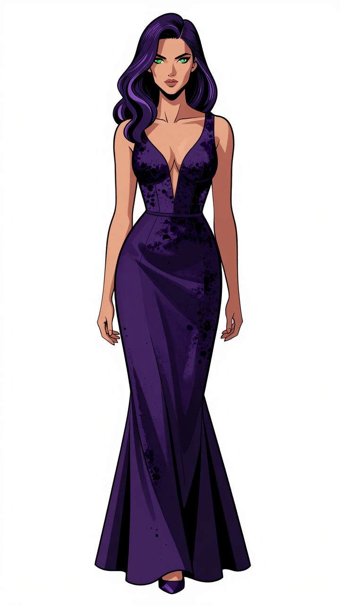
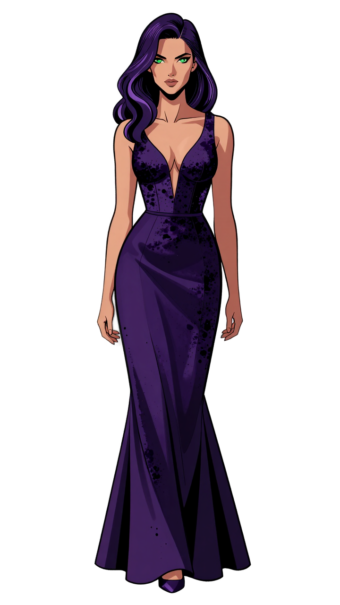

How to use this tool:

First time only: Double-click setup.bat and wait for it to finish. (It needs an internet connection to download the AI model and packages).

Every time after: Double-click start.bat.

A terminal window will open, and your browser will pop up with the tool.

Drag an image in, click "Remove Background", and download your PNG.

Close the browser tab and press CTRL + C in the terminal window when you're done.

## Example

Here's the tool in action:

**Before:**

**After:**

## Example 2

Here's the tool in action:

**Before:**

**After:**
.webp)
As you can see it's not perfect the railing is still there. But it cuts down on a lot of work removing complex backgrounds by hand.

## Example 3

Here's the tool in action:

**Before:**

**After:**

